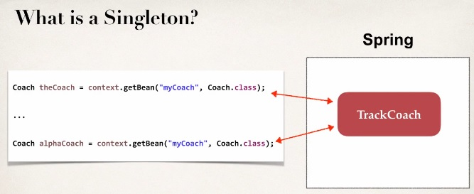
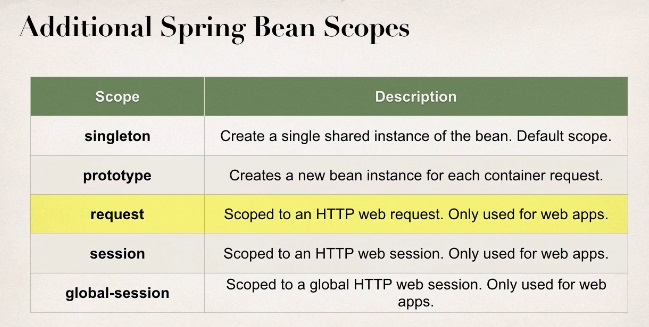
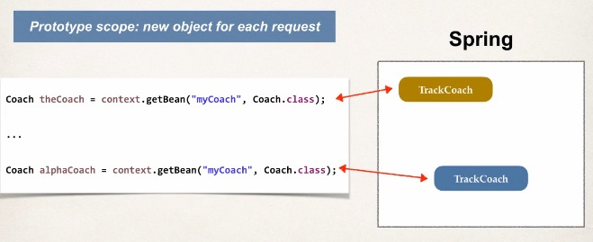
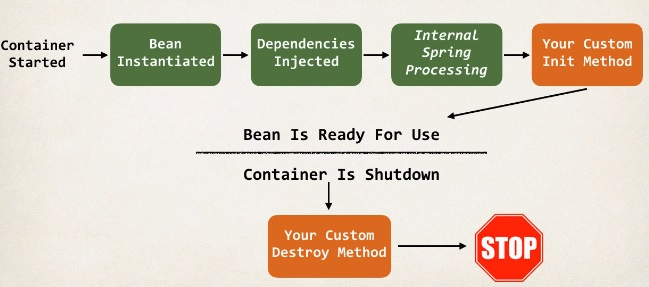

# **Bean Scope**

- Scope refers to the lifecyle of a bean.
- How long does the bean live?
- How many instances are created?
- How is the bean shared?

> **Default Scope: Singleton**

```Xml
    <beans ... >
        <bean id="myCoach"
            class="full qualified class name">
            ...
        </bean>
    </beans>
```

> **What is a singleton?**

- Spring Container creates only one instance of the bean, by default.
- It is cached in memory.
- All requests for the bean will return a SHARED reference to the SAME bean.



> Explicitly Specifiy Bean Scope

```Xml
    <beans ... >
        <bean id="myCoach"
            class="full qualified class name"
            scope="singleton">
            ...
        </bean>
    </beans>
```



## Prototype Scope Example

> ***Prototype Scope: new Object for each request.***

```Xml
    <beans ... >
        <bean id="myCoach"
            class="full qualified class name"
            scope="prototype">
            ...
        </bean>
    </beans>
```

  

- Prototype Scope is good for to track state of data.

## Bean Lifecycle

> So when the Spring container first starts there are couple of things that happens.
> First off, the beans are instantiated, and then the actual dependencies are injected.
> Next you have some internal Spring processing that occurs with the bean factory.
> And then you have the option of adding your own custom initialzation code.
> And then at that point the bean is ready for use. So we can call methods on it, do work with the bean and so on.
> At a certain point the containers actually shutdown meaning the application is shutdown.
> Like context.close()
> Then we also have chance to call our own custom destroy method. And that code will execute before the actual application is stopped or before the actual beans lifecyle is over.



### Bean Lifecycle Methods / Hooks

- You can add custom code during **bean initialization**. For example like custom business logic methods, setting up handles to resources (db, sockets, file, etc.)

- You can add custom code during **bean destruction**. For example like calling custom business logic, clean up handles to resources (db, sockets, files, etc.)

### How to do this

#### Init: method configuration

 ```Xml
    <beans ... >
        <bean id="myCoach"
            class="full qualified class name"
            init-method="doMyStartupStuff">
            ...
        </bean>
    </beans>
 ```

#### Destory: method configuration

 ```Xml
    <beans ... >
        <bean id="myCoach"
            class="full qualified class name"
            init-method="doMyStartupStuff"
            destory-method="doMyCleanupStuff">
            ...
        </bean>
    </beans>
 ```

### Developement Process

1. Define your methods for init and destory.
2. Configure the methods names in Spring config file.
