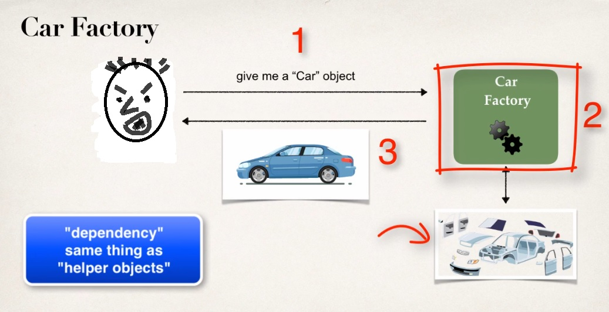
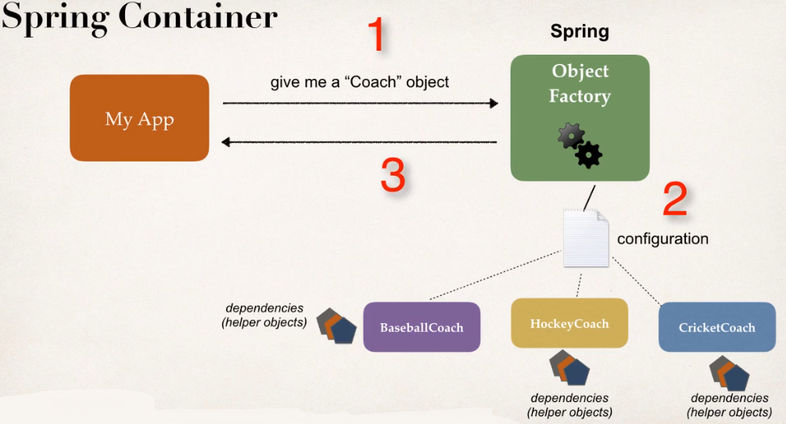

# Spring Dependency Injection (XML configuration)
   
   
   > Let's understand this with a example.
   > Say we're going to buy a car, and this car is built at the factory on demand.
   > So there's nothing in the car lot, we have to talk to the factory and put in a request and they'll build a car for us.
   > So at the factory we have all the different parts for the car. (enginer, tire, seat, etc.)
   > And technicians will assemble the car for us and deliver us the final car.
   > **so they actually inject *dependency* for the car**.
   > So that's basically what is dependency injection.

   **we simply out source the construction and injection of your object to an external entity.**
     in this case that's the car factory.

   
   **How this works in Spring world?**
   > Remeber spring has an Object factory.
   > So when we retrieve an Object like Coach object, this coach object mayhave some additional dependencies.
   > So these dependencies are really just helper objects, Ohter objects that it needs to perform it's operation.
   > So instead of developer having manually build the coach object and all it's dependencies the spring framework or the spring factory will actually do this.
   > So just like the car that's ready to drive, here we get an Object that's ready to use.
   
   
