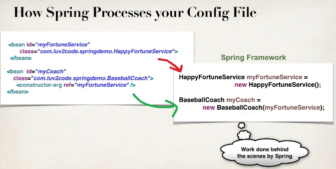

# Spring Dependency Injection (XML configuration)

   

   > Let's understand this with a example.
   > Say we're going to buy a car, and this car is built at the factory on demand.
   > So there's nothing in the car lot, we have to talk to the factory and put in a request and they'll build a car for us.
   > So at the factory we have all the different parts for the car. (enginer, tire, seat, etc.)
   > And technicians will assemble the car for us and deliver us the final car.
   > **so they actually inject *dependency* for the car**.
   > So that's basically what is dependency injection.

   **we simply out source the construction and injection of your object to an external entity.**
     in this case that's the car factory.

   **How this works in Spring world?**
   > Remeber spring has an Object factory.
   > So when we retrieve an Object like Coach object, this coach object mayhave some additional dependencies.
   > So these dependencies are really just helper objects, Ohter objects that it needs to perform it's operation.
   > So instead of developer having manually build the coach object and all it's dependencies the spring framework or the spring factory will actually do this.
   > So just like the car that's ready to drive, here we get an Object that's ready to use.

   

   **Demo Example**
      *Our Coach already provides daily workouts
      * Now will also provide daily fortunes
         *New helper: FortuneService
         * This is a *dependency*

## Injection Types

* There are many types of injection with Spring.
* Most two common are
  *Constructor Injection
  * Setter Injection
  * auto-wiring

### Developement Process - Constructor Injection

   1. Define the dependency interface and class
   2. Create a constructor in your class for injections
   3. Configre the dependency injection in Spring config file.

#### Step 1: Define the dependency inferface and class**

   ***FortuneService.java***

   ```Java
      public interface FortuneService {
         public String getFortune();
      }
   ```

   ***HappyFortuneService.java***

   ```Java
      public class HappyFortuneService implements FortuneService {
         public String getFortune(){
            return "Today is your lucly day!";
         }
      }
   ```

#### Step 2: Create a constructor in your class for injections**

   ***BaseballCoach.java***

   ```Java
      public class BaseballCoach implements Coach {
         private FortuneService fortuneService;

         public BaseballCoach(FortuneService theFortuneService){
            fortuneService = theFortuneService;
         }
         ...
      }
   ```

#### Step 3: Configure the dependency injection in Spring config file**

   ***applicationContext.xml***

   ```Xml
      <bean id="myFortuneService"
         class="fully qualified class name">
      </bean>
      <bean id="myCoach"
         class="fully qualified class name">
            <constructor-arg ref="myFortuneService" />
      </bean>
   ```

### How Spring Processes your Config File (Constructor Injection)

   ***applicationContext.xml***

   ```Xml
      <bean id="myFortuneService"
         class="full qualified class name">
      </bean>
      <bean id="myCoach"
         class="full qualified class name">
            <constructor-arg ref="myFortuneService" />
      </bean>
   ```

   > The Spring Framework will perform operations behind the scenes for you.
   ***Based on above config file Spring Framework will do this work***

   ```Java
      HappyFortuneService myFortuneService = new HappyFortuneService();
      BaseballCoach myCoach = new BaseballCoach(myFortuneService);
   ```

   
