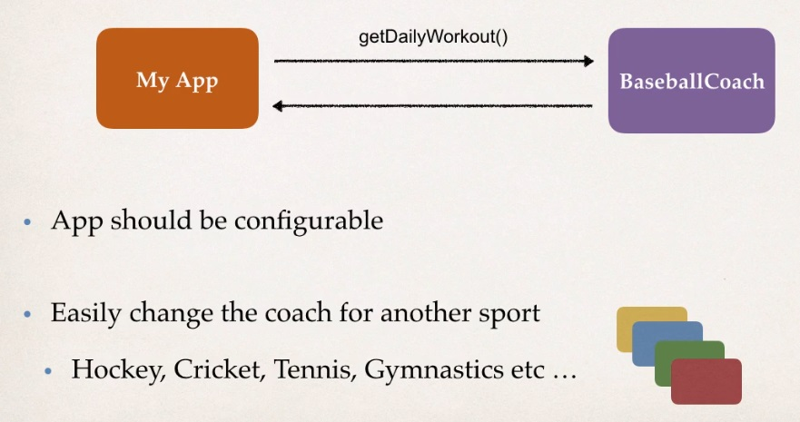
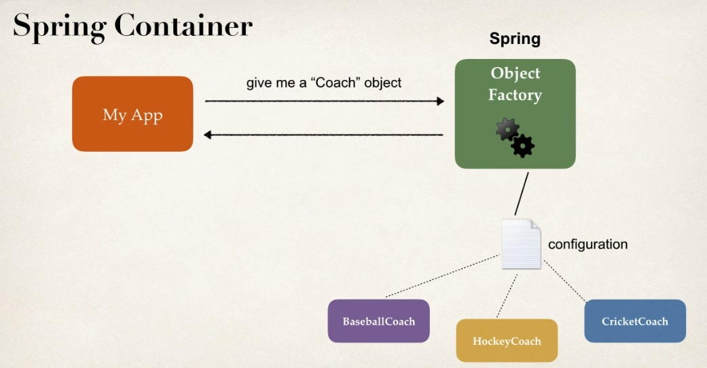

# Inversion of Control (IoC)
  What exactly is **Ioc** ?
  > It is simply the design process of externalizing, the construction and management of your objects.
  > *In a nutshell* It basically says, **that your application is gonna outsource the creation and management of objects. And this outsourcing will be handled by a object factory, and that's the big idea of INVERSION OF CONTROL**.

  ###### Coding Scenario
   > We're creating a app that will make use of a Coach, like a baseball Coach and this Coach should be able to give us DailyWorkOut method.
   > App should be configurable means this app should easily work for Coach of another Sport like Hockey, Cricket, Tennis, etc.
   
   
  
  ###### Code demo (Rough prototype)
   * **MyApp.java** main method
   * **BaseballCoach.java**
   * **Coach.java** interface after refactoring
   * **TrackCoach.java**
   
   **BaseballCoach.java**
   ```Java
      public class BaseballCoach implements Coach{
        @Override
        public String getDailyWorkOut(){
          return "practice batting";
        }
      }
   ```
    
   **MyApp.java**
   ```Java
      public class MyApp.java{
        public static void main(String[] args){
          //Create the object
          Coach theCoach = new BaseballCoach();
          Coach trackCoach = new TrackCoach();
          
          //use the object
          System.out.println(theCoach.getDailyWorkOut());
          System.out.println(trackCoach.getDailyWorkOut());
        }
      }
   ```
   
  **Coach.java**
  ```Java
      public interface Coach {
        public String getDailyWorkOut();
      }
  ```
  
  **TrackCoach.java**
  ```Java
     public class TrackCoach implements Coach{
        @Override
        public String getDailyWorkOut(){
            return "run 5 KM";
        }
     }
  ```
  
  - [ ] App should be configurable
  - [x] Easily change the coach for another sports
  
  > Till now we've made this app for any different type of Coach.
  > But the other requirement was the actual code implementation should be **configurable**. And right now it's not really configurable. Because it's ***hardcoded*** rightnow.
  > Idealy it will be great if we could actually read the implementaton name from a config file, and then make use of it. So then we could easilt swap by only changing a config file instead of having a change in source code.
  > *Spring was designed to address this exact problem.*


###### Spring Inversion of Control
  > Spring provides and object factory so our application talk to spring and ask, hey give me an object.
  > Based on a Configuration file or annotation, spring will provide appropriate implementation.
  > So then app will be configurable and will have full support for that based on our application requirements.
  
  
  
  **Spring Container**
  * Primary functions
    * Create and manage objects (Inversion of Control)
    * Inject Object's dependencies (Dependency injection)
    
  **Configuring a Spring Container**
  > There are three ways of configuring a spring container
    * XML configuration file (*legacy, but most legacy app still use this*).
    * Java Annotations (*modern*)
    * Java Source Code (*modern*)
    
  
###### Spring Development Process
  
  1. Configure your Spring Beans.
  2. Create a Spring Container.
  3. Retrieve Beans from Spring Container.
  
  **Step 1: Configuring your spring Beans**
    **File: applicationContext.xml**
   ```Xml
      <beans ...>
            
           <bean id="myCoach"
              class="full class path name">
           </bean>
      </beans>
   ```
